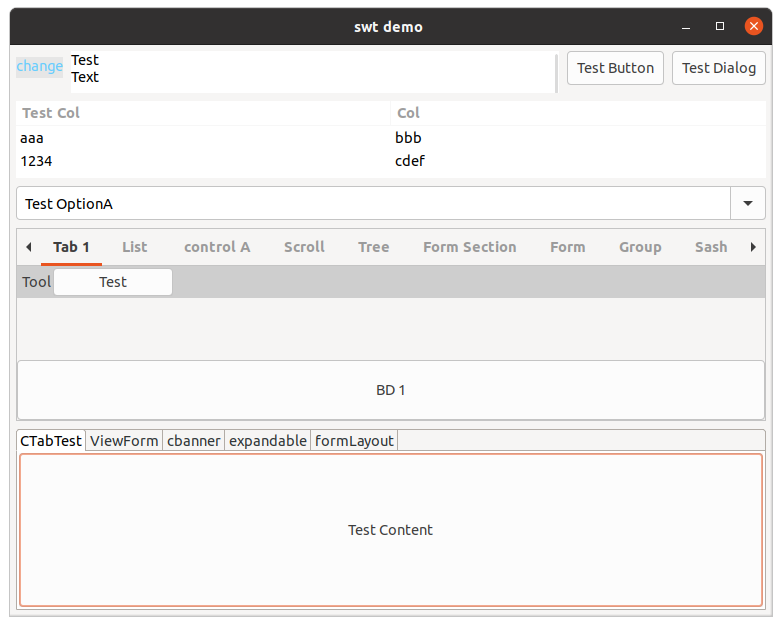
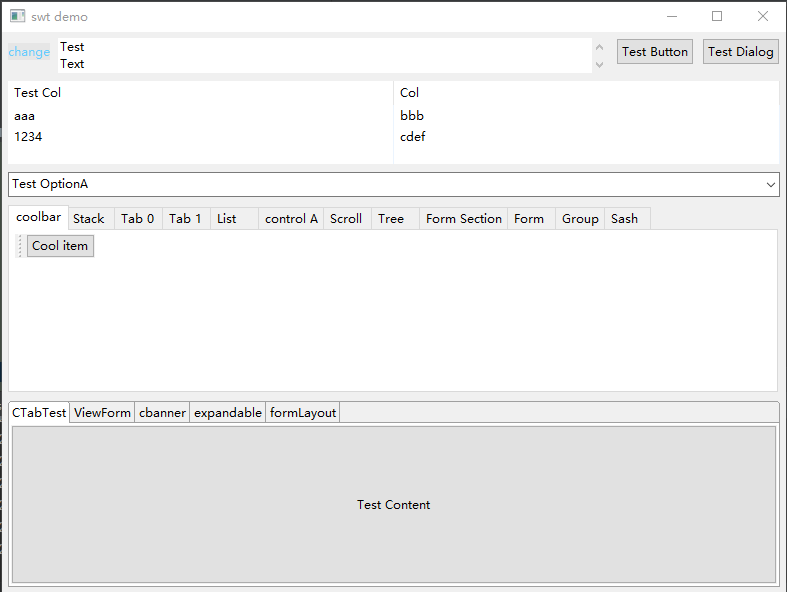
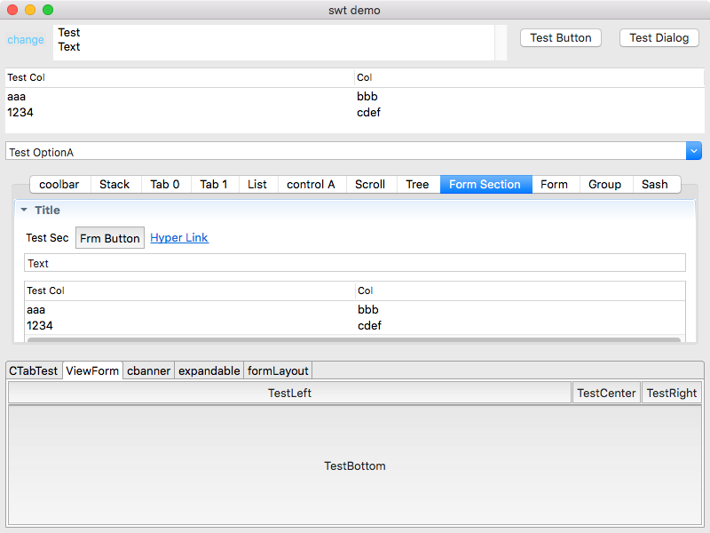

# 基于自研框架application的Eclipse-SWT/JFace框架

## 运行截图

## 进度
- [x] 基于Groovy制作一个用于SWT界面的DSL
- [x] Controller以及Controller内部的view注入
- [x] View管理器
- [x] SWT Application 框架主体
- [x] 跨平台可行性验证以及测试

## 最新进展

大部分组件已经被groovy支持，所以基本能够通过Groovy进行界面的编程了。

对于跨平台的使用，不同的不同需要不同的swt-wapper，他们都在standalone的project中可以找到。

某些地区的maven不能很好的下载一些package，如果你发现一部分的maven依赖出现了问题，
你需要手动查找这些包并且下载到自己的本地maven仓库中，当然，这些maven包我有整理过，后续说不定什么时候
会放上来。

请注意：如果在macos使用SWT，需要添加JVM参数：-XstartOnFirstThread